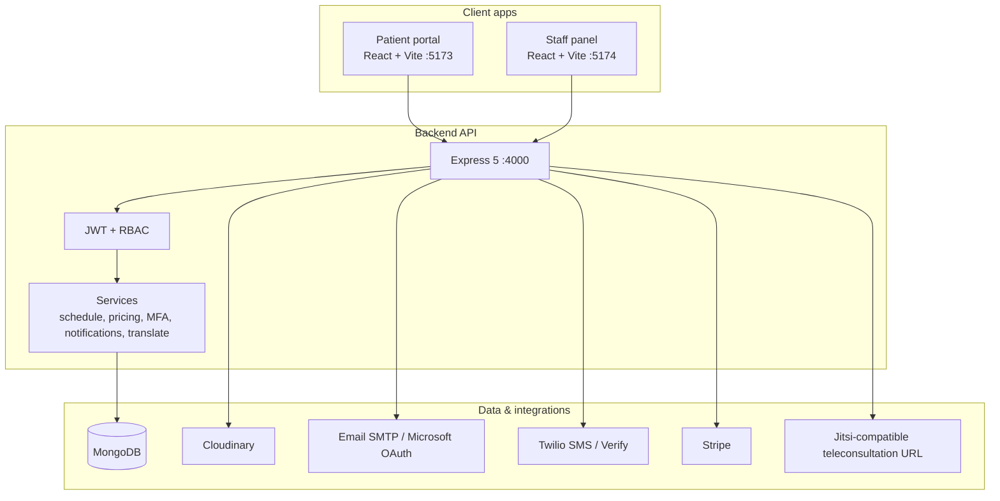

<div align="center">


# Clinivo — Smart Clinic & Healthcare Management Platform

### *Appointments, telemedicine, prescriptions, insurance, and operations — in one place.*

<br/>

[](https://react.dev)
[](https://nodejs.org)
[](https://mongodb.com)
[](https://expressjs.com)
[](https://tailwindcss.com)
[](https://stripe.com)
[](LICENSE)

<br/>

> **Production-ready, full-stack clinic software** with dedicated experiences for **Patients**, **Doctors**, **Receptionists**, and **Admins** — bilingual (English / Arabic), configurable branding, and deep scheduling controls.

</div>

---

## Table of Contents

- [Why Clinivo?](#why-clinivo)
- [What's New](#whats-new)
- [Features by Role](#features-by-role)
- [Architecture](#architecture)
- [Tech Stack](#tech-stack)
- [Project Structure](#project-structure)
- [Testing](#testing)
- [Installation & Setup](#installation--setup)
- [Environment Variables](#environment-variables)
- [API Overview](#api-overview)
- [Roles & Authentication](#roles--authentication)
- [Deployment Notes](#deployment-notes)
- [Roadmap](#roadmap)
- [Contributing](#contributing)
- [Author](#author)
- [License](#license)

---

## Why Clinivo?

Clinics still lose time on phone bookings, paper prescriptions, and fragmented patient records. **Clinivo** replaces that with a single platform: patients book online, doctors run their day from a portal, reception handles walk-ins and payments, and admins control branding, security, and analytics.

| Challenge | Clinivo solution |
|---|---|
| Phone-only booking | 24/7 self-service booking with live slot availability |
| One doctor, one address | **Multi-location** schedules per clinic branch |
| Only in-person visits | **Clinic**, **voice**, **video**, and **home visit** modes |
| Paper prescriptions | Digital prescriptions with edit history |
| No front-desk tooling | **Receptionist portal** — book, check-in, payments, insurance |
| Weak security | JWT + RBAC, optional **MFA (TOTP)**, audit logs |
| Static website | Admin **CMS** for hero, banner, logo, footer, and copy |
| Language barriers | **English & Arabic** UI with per-role language policies |

The product name is **white-label**: set `PUBLIC_APP_BRAND` / `VITE_APP_DISPLAY_NAME` and upload a logo in Admin → Site logo.

---

## What's New

Recent major capabilities (beyond the original patient/doctor/admin scope):

- **Receptionist role** — dashboard, appointments, patient registry, on-desk booking, check-in, payment status, insurance verification
- **Multi-clinic & multi-location** — platform clinics, doctor branch locations, per-location availability
- **Appointment modes** — Clinic, Voice Call, Video Call (Jitsi-compatible links), Home Visit (Cairo/Giza areas + admin pricing)
- **Stripe payments** — online booking payment intents (EGP by default)
- **Insurance** — patient insurance profiles, provider list, visit-level verification by staff
- **MFA** — TOTP for admin, doctor, receptionist, and patient (policy-driven)
- **Signup & account verification** — email/phone OTP during signup and post-registration verification
- **Notifications** — in-app notification bell for patients and staff
- **Ratings & reviews** — patients rate doctors; admin moderation
- **Financial analytics** — admin platform analytics and per-doctor compensation views
- **Audit logs** — admin activity trail
- **Site CMS** — hero, banner, service cards, footer, languages, security policies
- **Promo codes** — per-doctor discounts on bookings
- **Auto-translation** — optional Google Translate or LibreTranslate for dynamic content

---

## Features by Role

### Patient portal (`frontend/` — port **5173**)

- Register / login with **email & phone verification** (signup OTP + account verify flows)
- **MFA** setup (TOTP) when required by security policy
- Browse doctors by speciality, fees, experience, ratings, and availability
- Book **Clinic** (with **location picker**), **Voice Call**, **Video Call**, or **Home Visit**
- Flexible **doctor-defined schedules** (working days, breaks, slot duration, blocked dates)
- **Stripe** checkout for online-paid appointments
- **Promo codes**, insurance-covered visits, medical history, insurance card upload
- **My appointments**, cancel, view prescriptions, **rate doctors**
- **Medical history** and **insurance** pages
- **English / Arabic** with Eastern Arabic numerals where applicable
- **In-app notifications**

### Doctor portal (`admin/` — doctor login)

- Dashboard: earnings, appointments, patients
- Appointments: complete, cancel, write/edit **digital prescriptions**
- **Availability**: main schedule + **per-location branch schedules**
- **Home visit** schedule and service areas
- Profile: fees, modes (voice/video/home), promo codes, clinic locations
- **Patient history** and medical record updates
- **Financial analysis** (compensation vs. revenue)
- **MFA** and own ratings view

### Receptionist portal (`admin/` — receptionist login)

- Dashboard and appointment list with status workflow (**Booked → Checked In → In Progress → Finished**)
- **Book appointments** for walk-in / phone patients (create patient if needed)
- **Check-in**, update status, **payment** (Cash / Visa / Insurance / Free)
- **Insurance verification** at visit time
- Patient search, profile, insurance updates
- View doctors, clinics, ratings; manage doctor **clinic locations** (where permitted)
- **Home visit address** updates on appointments
- Profile and **MFA**

### Admin portal (`admin/` — admin login)

- Platform dashboard and **financial analytics**
- **Users** hub: patients, doctors, receptionists — create, edit, reset password, MFA policy
- **Clinics** — create branches, assign doctors
- Appointments: all / active / finished, cancel, history cleanup
- Doctors: add/edit, availability, compensation settings, ratings moderation
- Receptionists: add/edit, activate/deactivate
- **Audit logs**
- **Site CMS**: logo, home hero, banner, service cards, footer, insurance providers, home-visit pricing, **language policies**, **security settings**
- **MFA** for admin account

---

## Architecture



**Monorepo layout:** three apps sharing one API — `frontend/`, `admin/`, `backend/`.

---

## Tech Stack

### Frontend & staff panel

| Technology | Role |
|---|---|
| **React 19** | UI |
| **Vite 7** | Dev server & build |
| **Tailwind CSS 4** | Styling |
| **React Router 7** | Routing |
| **Axios** | HTTP |
| **Lucide React** | Icons |
| **React Toastify** | Notifications |
| **Stripe.js** | Patient online payments |
| **qrcode** | MFA setup QR codes |

### Backend

| Technology | Role |
|---|---|
| **Node.js + Express 5** | REST API |
| **MongoDB + Mongoose 8** | Database |
| **JWT + custom RBAC** | Auth & permissions |
| **Bcrypt** | Password hashing |
| **Cloudinary** | Image uploads |
| **Nodemailer** | Email (Gmail, SMTP, or Microsoft OAuth) |
| **Stripe** | Payment intents & refunds |
| **Twilio** | SMS & phone OTP (optional) |
| **Validator** | Input validation |

### Infrastructure (typical)

| Service | Purpose |
|---|---|
| **MongoDB Atlas** | Database |
| **Cloudinary** | Media CDN |
| **Stripe** | Payments |
| **Twilio** | SMS / Verify (optional) |
| **Vercel / VPS** | Hosting (frontend, admin, API) |

---

## Project Structure

```
clinicSys/
│
├── frontend/                 # Patient portal (Vite :5173)
│   └── src/
│       ├── components/       # Navbar, Footer, TopDoctors, notifications, MFA, etc.
│       ├── context/          # AppContext — API + site settings
│       ├── pages/            # Home, Doctors, Appointment, Login, Insurance, …
│       ├── utils/            # schedule, promo, insurance, i18n helpers
│       └── i18n.jsx          # English / Arabic translations
│
├── admin/                    # Staff panel — Admin, Doctor, Receptionist (:5174)
│   └── src/
│       ├── components/       # Navbar, Sidebar, NotificationBell, MFA, …
│       ├── context/          # AdminContext, DoctorContext, ReceptionistContext
│       └── pages/
│           ├── Admin/        # Dashboard, users, clinics, CMS, analytics, audit
│           ├── Doctor/       # Appointments, availability, prescriptions, finance
│           └── Receptionist/ # Desk booking, patients, check-in, payments
│
├── backend/                  # Express API (:4000)
│   ├── config/               # MongoDB, Cloudinary, email, Stripe, brand
│   ├── controllers/          # Route handlers
│   ├── middlewares/          # auth*, multer, rbac
│   ├── models/               # user, doctor, appointment, clinic, site settings, …
│   ├── routes/               # admin, doctor, user, receptionist, notifications, audit
│   ├── services/             # schedule, MFA, pricing, notifications, translate, …
│   └── server.js
│
├── MULTI_CLINIC_LOCATIONS_GUIDE.md   # Doctor multi-location how-to
└── IMPLEMENTATION_SUMMARY.md         # Multi-location implementation notes
```

---

## Testing

Vitest is configured for **backend**, **frontend**, and **admin**. From the repo root:

```bash
npm test                 # all three packages (unit tests)
npm run test:integration # backend in-memory MongoDB checks
npm run test:all         # unit + backend integration
```

See **[TESTING.md](./TESTING.md)** for per-package commands, `.env.test`, DB helpers, and how to add new tests.

---

## Installation & Setup

### Prerequisites

- **Node.js** ≥ 18
- **MongoDB** (local or Atlas)
- **Cloudinary** account (doctor/patient images, CMS assets)
- **Email** — Gmail app password, custom SMTP, or Microsoft OAuth (see env vars)
- Optional: **Stripe**, **Twilio**, translation API keys

### 1. Clone

```bash
git clone <your-repo-url>
cd clinicSys
```

### 2. Backend

```bash
cd backend
npm install
```

From the **repo root**, create shared env files (see [Environment Variables](#environment-variables)):

```bash
npm run env:init   # copies .env.example → .env and .env.prod.example → .env.prod
# edit .env with your MongoDB, JWT, Cloudinary, email, etc.
```

```bash
cd backend
npm run server    # development (nodemon)
# npm start       # production
```

API: `http://localhost:4000` → `GET /` returns `API WORKING`.

### 3. Patient frontend

```bash
cd ../frontend
npm install
```

Uses root `.env` automatically (no `frontend/.env` needed).

```bash
npm run dev
```

Patient portal: `http://localhost:5173`

### 4. Staff panel (admin / doctor / receptionist)

```bash
cd ../admin
npm install
```

Uses root `.env` automatically (no `admin/.env` needed).

```bash
npm run dev
```

Staff panel: `http://localhost:5174` — single login screen; role determined by credentials.

### Default ports

| App | Port |
|---|---|
| Backend API | 4000 |
| Patient frontend | 5173 |
| Staff panel | 5174 |

---

## Environment Variables

**Single source:** repo root `.env` (local) and `.env.prod` (production overrides).

| File | Purpose |
|---|---|
| `.env.example` | Template for local dev — copy to `.env` |
| `.env.prod.example` | Template for production — copy to `.env.prod` |
| `.env` | Local secrets (gitignored) |
| `.env.prod` | Production URLs & secrets (gitignored; loaded on Vercel, `vite build`, `APP_ENV=production`) |

```bash
npm run env:init   # from repo root: creates .env and .env.prod from examples
```

**Backend**, **frontend**, and **admin** all read from these files. Key variables:

- `API_PUBLIC_URL` / `VITE_BACKEND_URL` — API base URL for apps (set both to the same live API on Vercel; no `:4000`)
- `CORS_ORIGINS` — comma-separated patient + staff origins for the API
- `APP_DISPLAY_NAME` / `VITE_APP_DISPLAY_NAME` — branding
- Backend: `MONGODB_URI`, `JWT_SECRET`, `ADMIN_EMAIL`, `ADMIN_PASSWORD`, Cloudinary, email, Stripe, etc.

See **`.env.example`** for the full list with comments.

**Production build (patient or staff app):**

```bash
# fill .env.prod with https://your-api.vercel.app and CORS_ORIGINS
cd frontend && npm run build
cd admin && npm run build
```

On Vercel, set the same variable names in each project's Environment Variables (or paste from `.env.prod`).

> **Never commit `.env` or `.env.prod`.** Use `.env.example` / `.env.prod.example` in git only.

**Gmail app password:** Google Account → Security → 2-Step Verification → App passwords.

**Microsoft mail:** set `EMAIL_SERVICE=outlook`, configure OAuth vars, run `npm run microsoft:auth` in `backend/` to obtain a refresh token.

---

## API Overview

**Base URL:** `http://localhost:4000` (or your deployed API)

| Prefix | Audience | Purpose |
|---|---|---|
| `/api/user` | Public + patients | Auth, signup verify, profile, medical history, booking, payments, ratings, site settings |
| `/api/doctor` | Public + doctors | Doctor list, login, MFA, appointments, prescriptions, profile, availability |
| `/api/admin` | Admins | Users, clinics, appointments, CMS, analytics, audit, ratings moderation |
| `/api/receptionist` | Receptionists | Desk booking, patients, check-in, payments, insurance verify |
| `/api/notifications` | Any authenticated role | List, unread count, mark read |
| `/api/audit-logs` | Admins | Activity log (also mounted under admin routes) |

### Auth headers

| Role | Header | Login route |
|---|---|---|
| Patient | `token` | `POST /api/user/login` |
| Doctor | `dtoken` | `POST /api/doctor/login` |
| Admin | `atoken` | `POST /api/admin/login` |
| Receptionist | `rtoken` | `POST /api/receptionist/login` |

MFA-enabled accounts receive a short-lived MFA token first, then complete setup via `/mfa/verify-login` and related routes.

### Representative endpoints

<details>
<summary><b>Patient — <code>/api/user</code></b></summary>

| Method | Endpoint | Notes |
|---|---|---|
| POST | `/register` | New patient |
| POST | `/login` | Returns token or MFA challenge |
| POST | `/signup-verify/*` | Email/phone codes before register |
| POST | `/verify-account/*` | Post-registration verification |
| GET | `/site-settings` | Public branding & CMS snapshot |
| GET | `/insurance-providers` | Accepted providers |
| POST | `/book-appointment` | Book slot |
| POST | `/create-booking-payment-intent` | Stripe |
| GET | `/appointments` | Own appointments |
| POST | `/cancel-appointment` | Cancel |
| GET/POST/PUT | `/medical-history` | Patient history |
| POST | `/ratings` | Rate doctor |
| POST | `/send-reset-otp` … `/reset-password` | Password reset |

</details>

<details>
<summary><b>Doctor — <code>/api/doctor</code></b></summary>

| Method | Endpoint | Notes |
|---|---|---|
| GET | `/list` | Public doctor directory |
| GET | `/clinics` | Public clinic list |
| POST | `/login` | Doctor auth |
| GET | `/appointments` | Assigned appointments |
| POST | `/complete-appointment` | Complete + prescription |
| POST | `/edit-prescription` | Edit with history |
| GET | `/patient-history` | Treated patients |
| GET/POST | `/profile`, `/update-profile` | Profile & schedule |

</details>

<details>
<summary><b>Admin — <code>/api/admin</code></b></summary>

| Method | Endpoint | Notes |
|---|---|---|
| POST | `/login` | Admin auth (+ MFA) |
| GET | `/dashboard` | Stats |
| GET | `/financial-analytics` | Revenue & compensation |
| GET/POST | `/patients`, `/users`, `/all-doctors` | User management |
| GET/POST | `/clinics`, `/create-clinic`, … | Clinic branches |
| GET | `/appointments`, `/appointment-history` | Oversight |
| POST | `/site-settings/*` | CMS & policies |
| GET | `/audit-logs` | Compliance trail |

</details>

<details>
<summary><b>Receptionist — <code>/api/receptionist</code></b></summary>

| Method | Endpoint | Notes |
|---|---|---|
| POST | `/login` | Receptionist auth |
| GET | `/dashboard`, `/appointments` | Operations |
| POST | `/book-appointment` | Book for patient |
| POST | `/check-in`, `/appointment-status` | Workflow |
| POST | `/payment` | Record payment |
| POST | `/patient-insurance-verify` | Insurance at visit |
| GET | `/patients`, `/doctors`, `/clinics` | Directory |

</details>

---

## Roles & Authentication

```text
┌─────────────┐     ┌─────────────┐     ┌──────────────────┐     ┌─────────────┐
│   Patient   │     │   Doctor    │     │  Receptionist    │     │    Admin    │
│  frontend   │     │ admin panel │     │  admin panel     │     │ admin panel │
└──────┬──────┘     └──────┬──────┘     └────────┬─────────┘     └──────┬──────┘
       │ token             │ dtoken              │ rtoken               │ atoken
       └───────────────────┴─────────────────────┴──────────────────────┘
                                    │
                           Express + RBAC middleware
                                    │
                              MongoDB Atlas
```

Permissions are defined per role in `backend/middlewares/rbac.js` (e.g. `manage clinics`, `edit prescriptions`, `manage payment status`).

---

## Deployment Notes

1. Deploy **backend** with all required env vars; use a process manager (PM2, systemd) or serverless adapter if supported.
2. Build frontends: `npm run build` in `frontend/` and `admin/`; serve static files behind HTTPS.
3. Set `VITE_BACKEND_URL` to your **production API URL** at build time for each frontend.
4. Configure **CORS** if API and apps are on different origins (Express `cors` is enabled by default).
5. Use **MongoDB Atlas** IP allowlist and strong `JWT_SECRET`.
6. For teleconsultation, point `TELECONSULTATION_BASE_URL` to your Jitsi-compatible server.

---

## Roadmap

Implemented items from earlier plans (payments, SMS hooks, ratings, audit logs, multi-branch, analytics, bilingual UI) are **live**. Upcoming ideas:

- Native **iOS / Android** apps (React Native)
- **HL7 FHIR** / HIPAA-oriented compliance pack
- **Pharmacy & lab** integrations
- **AI-assisted** triage / no-show prediction
- **In-app chat** between patient and clinic
- Additional payment gateways (local wallets)

---

## Contributing

1. Fork the repository
2. Create a branch: `git checkout -b feature/your-feature`
3. Commit: `git commit -m 'Add: your feature'`
4. Push: `git push origin feature/your-feature`
5. Open a Pull Request

Please keep changes focused, match existing code style, and do not commit secrets.

---

## Author

<div align="center">

**Muhammad Arqum**  
*Full Stack Developer — healthcare & clinic systems*

<br/>

[](https://www.linkedin.com/in/muhammadarqumtariq/)
[](mailto:marqum987@gmail.com)

📍 Karachi, Pakistan

<br/>

*Deploying Clinivo for your clinic or hospital? Reach out.*

</div>

---

## License

This project is licensed under the **MIT License** — free to use, modify, and distribute.

---

<div align="center">

**If Clinivo helps your clinic, consider giving the repo a star.**

*Built for modern clinics — Egypt, MENA, and beyond.*

*© 2026 Clinivo*

</div>
